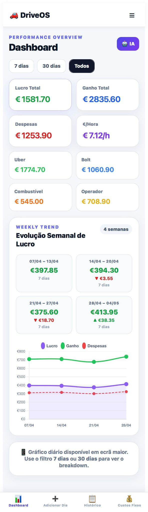

# 🚗 Driver Finance Dashboard

A data-driven dashboard built to help ride-hailing drivers (Uber & Bolt) understand their **real profitability** and make better daily decisions.

---

## 💡 Why this project exists

As a TVDE driver, I realized something critical:

> Most drivers track earnings… but don't actually know if they are making money.

This dashboard solves that problem by turning raw daily data into **clear financial insights**.

---

## 🚀 Key Features

### 📊 Monthly & Weekly Navigation
- Browse data **month by month** — no more mixed periods
- Each month shows its weeks in isolation
- Week-over-week delta within the same month
- Annual overview with one card per month — clickable to drill down

### 💰 Fixed Cost Control & Break-Even Analysis
- Track all fixed costs: car lease, insurance, IUC, maintenance, washing, food, taxes
- Operator commission (%) configured once — applied automatically to every day
- Fuel tracked per day — summed automatically, no double entry
- Real-time weekly break-even analysis: are you covering your costs this week?
- Smart recommendations: how many more hours or days you need to break even

### 🎯 Weekly Goal Tracking
- Set a weekly earnings target directly on the Dashboard
- Progress bar updated in real time as days are added
- AI analysis tells you exactly how many more hours or days you need to hit your goal

### 📅 Cash Flow — Expense Due-Date Tracking
- Set a due day (1–31) for each fixed monthly/annual cost: instalment, insurance, road tax (IUC), oil, tires, maintenance, VAT
- The dashboard automatically calculates how many days remain until each expense is due and how much to set aside per day to cover it
- "Upcoming Expenses" card lists all due costs sorted by urgency
- "Today's Goal" card combines the remaining weekly target (spread across the days left in the week) with the daily reserve needed for upcoming expenses
- Expenses due within 14 days are automatically included in the weekly break-even analysis

### 🗺️ Kilometre Tracking
- Log start and end km for each day
- Total km, profit per km, and km per hour calculated automatically
- Weekly km summary on the Dashboard

### 🎁 Tips Tracking
- Separate fields for Uber app tips, Bolt app tips, and cash tips
- Total earnings calculated automatically — no manual math
- Tips visible as a standalone metric in the Dashboard

### 📄 Document Expiry Control
- Track all TVDE documents with expiry dates
- 6 pre-loaded shortcuts for the most common documents
- Three-level alerts: 🟢 Valid · 🟡 Renew soon · 🔴 Urgent / Expired
- Recommended renewal date calculated automatically (15 days before expiry)
- Red badge on navigation when something needs attention

### 🔄 Dual Input System
Supports two real-world workflows:
- **Quick Mode** → total earnings per day
- **Detailed Mode** → ride-by-ride tracking

### ⚖️ Uber vs Bolt Comparison
- Understand which platform performs better
- Data-driven decision making

### 📈 Smart Insights
- Profitability analysis per period
- Profit per hour and profit per km
- Weekly trend with week-over-week delta
- Break-even status with actionable recommendations
- Daily revenue target combining weekly goal pacing with upcoming expense reserves

---

## 🧠 Key Insight

This project is built around a real constraint:

> Drivers don't think daily — they think weekly (because they get paid weekly).

That's why the dashboard focuses on **weekly analytics inside monthly views** — and shows whether fixed costs are being covered each week, including upcoming bills before they hit.

---

## 🛠️ Tech Stack

- TypeScript (strict mode, full migration)
- React (Hooks + Context API)
- React Router v6 (client-side routing)
- Vite (build tool)
- Chart.js (data visualization)
- Vitest (unit tests — 9 passing)
- Mobile-first responsive layout

---

## 📸 Preview

### Dashboard Overview

---

## 🚀 Live Demo

👉 https://driver-finance-dashboard.vercel.app

---

## 🎯 What I focused on

- Turning a real-world problem into a digital product
- Building business logic, not just UI
- Creating a usable tool, not just a demo project
- Mobile-first responsive layout with bottom navigation
- No double data entry — fuel, operator costs, and tips flow automatically
- Full TypeScript migration with typed interfaces and strict mode
- Unit tested with Vitest

---

## 🔮 Next Steps

- Backend integration (Firebase)
- Push notifications for document expiry
- Best day / best time detection
- PDF/Excel export

---

## 👨‍💻 About Me

Frontend Developer transitioning from Civil Engineering, focused on building **real-world, data-driven applications**.

---